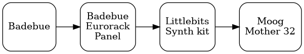
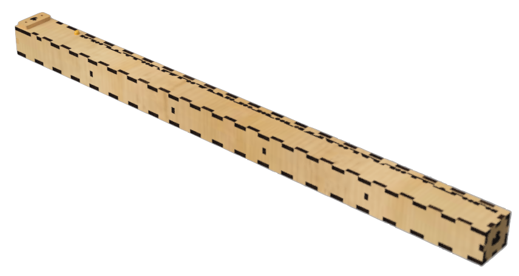
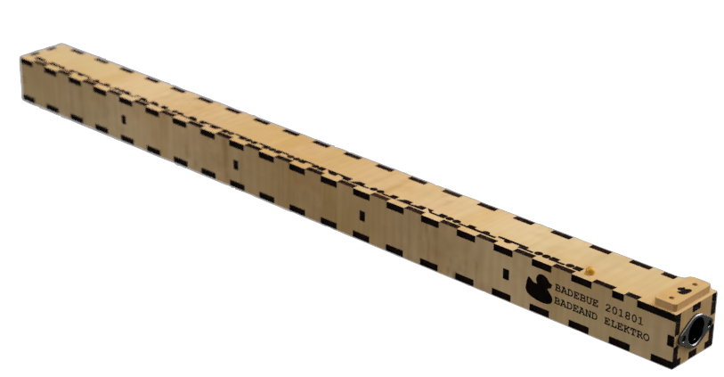
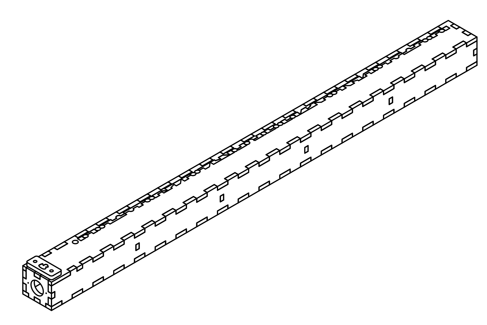
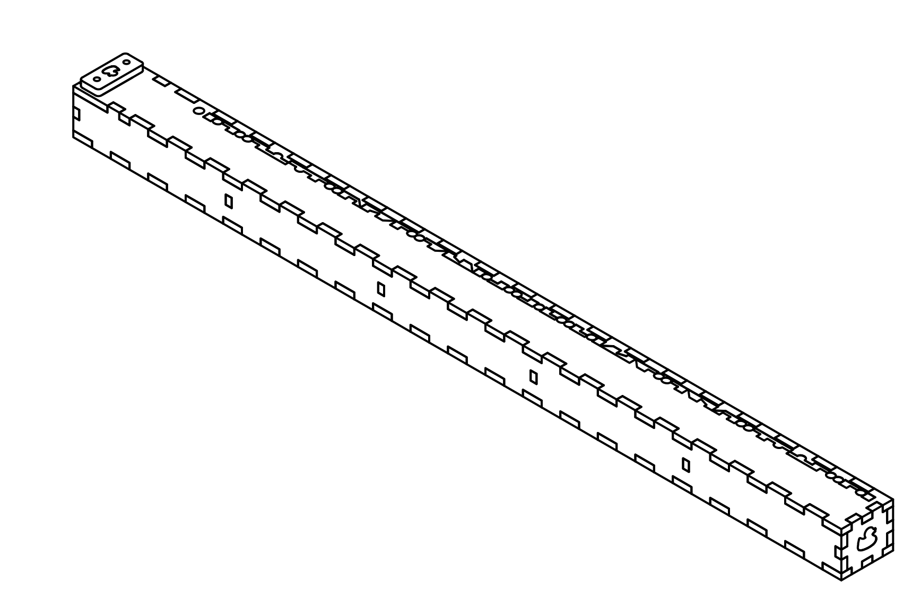
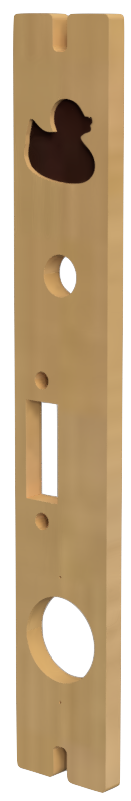
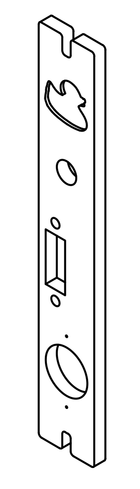

## Badebue

Electronic instrument designed, constructed and programmed by me.

### Videos
* [Test 20200430](https://www.youtube.com/watch?v=d4j33tDIAvo)

### Bue drawings and renderings

### Panel drawings and renderings

