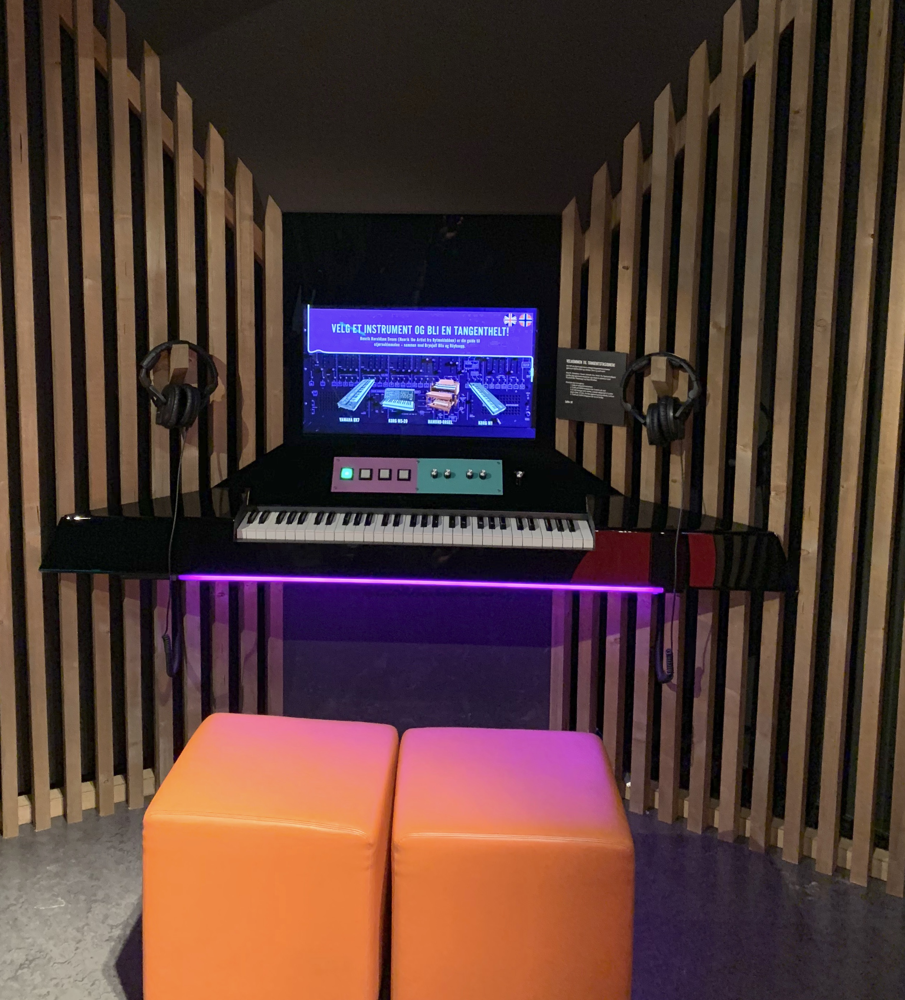

The temporary exhibition Fuzz opened 20. October 2017 at Popsenteret in Oslo.

Fuzz looks at music and technology, and how technology has changed the music and our acceptance on use of technology in music.

Visitors are invited to to try out instruments and music technology by their own.

As part of the exhibition there are stations for guitar, bass, synth and drums where the visitors may use actual instruments and adjust effect on the sound using a physical interface.

The physical interface mimics actual effect and/ or instrument parameters, and the visitors are guided through different musical styles by acclaimed norwegian artists and producers.

Custom interface has been developed in Max as part of the exhibition to integrate video content, music technology and physical user interface components.

The followings instruments wrere modelled:
 - Electric guitar
 - Electric bass
 - Keyboards
 - Drums

In the development of the exhibition, emphasis has been placed on technology that is commenly used by the music industry:

### Max

Max was used to create the program that integrates custom produced video content, sound effects, graphical interfaces and physical interfaces into one unified experience.

Max is a modular visual programming language that is used in the music industry to develop programs for composition, research, teaching and development of art installations and new musical instruments. The language is recognized by the music industry and is used by many artists to create music. It is also well suited for multimedia and is very well suited for development of interactive installations. Max is well suited for integation of physical objects, lighting installations and musical equipment.

Max dates back to the 1980s and was invented at the French music institute IRCAM. Max is now sold and maintained by the US company cycling74.

### Arduino

Arduino is a simple microprocessor platform consisting of open soucre software and hardware.

Arduino was used to simulate physical equipment. The Arduino units provide communication between physical surfaces and the computer by detecting setttings made by the user on switches and knobs. It is also very useful to provide feedback to the user (using, for example, indicator lights).

### VST

VST (also called plugins) is additional software used by the music industry for recording and producing music. The software simulates the sound characteristics of physical music equipment and the effect various settings of the equipment have on the sound. VST, for example, can give the sound of a guitar amplifier that is characteristic of a music style.

In the exhibition, this technology is used to show users how different equipment affects the sound of an instrument. The software recreates the effect of analog and digital equipment in a way that can be controlled from Max.

