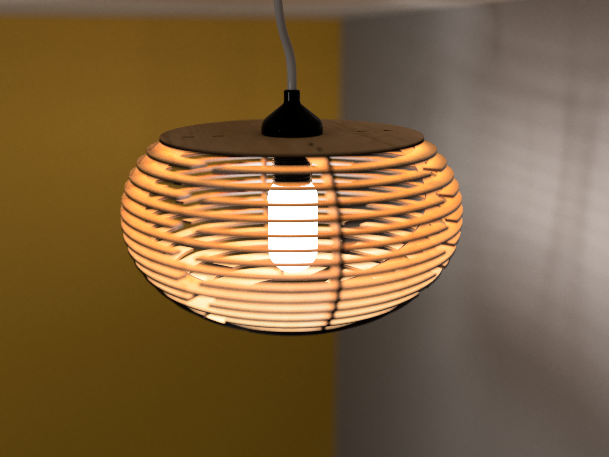
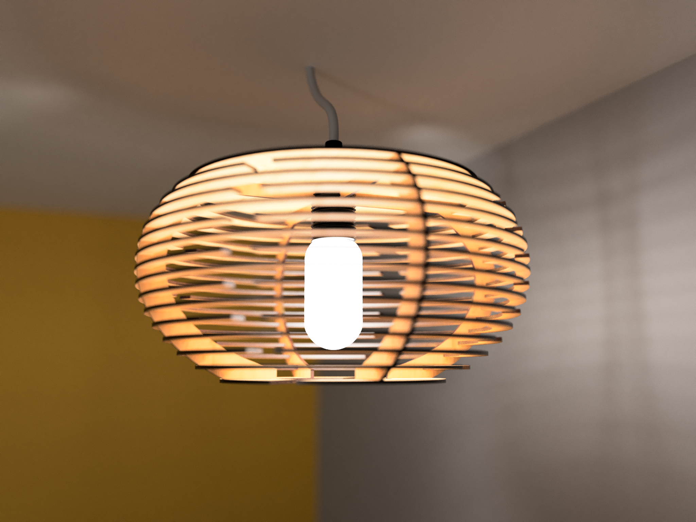
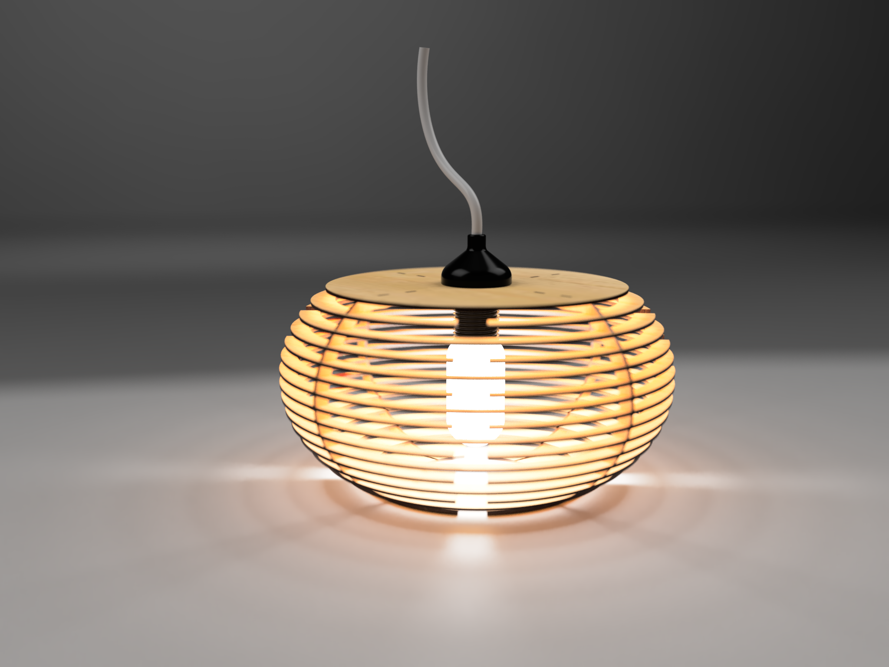
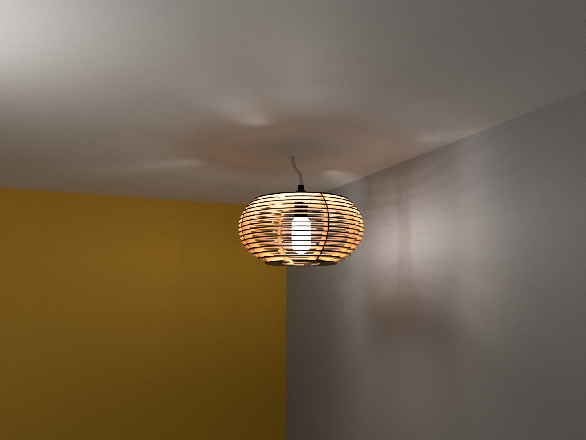

# Lamp 01

I needed a lamp for the bedroom, and wanted to design my own.

My first attempt at designing a lamp.

The designs are open source, so you can easily and freely make one your own if you have access to a laser printer. Material thickness is 3 mm.

## Credits
The following designs were used in the rendered illustrations:
- [E27 lamp holder by Phil Maddox (June 10th, 2018)](https://grabcad.com/library/e27-lamp-holder-1)
- [E27 Light Bulbs by Luca Messina (March 6th, 2017)](https://grabcad.com/library/e27-light-bulbs-1)
